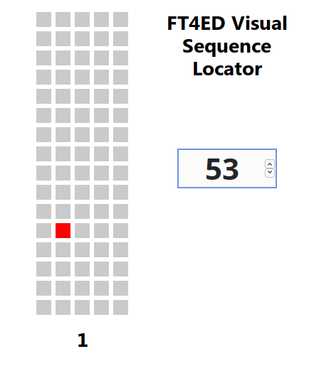

# FT4ED Sequence Locator

This is a small tool that determines the physical location of a FT4ED specimen tube while it is in a load rack, given the sequence number.



License: MIT

## Description

All tubes are stored in "loads" prior to being scanned into a proper trackable location.
FT4ED loads are kept in a 16x5 configuration spanning two racks with sequence numbers up to 180.
This makes it troublesome when pulling many tubes from loads with sequence numbers like 177, 45, etc.

This tool displays a diagram of a FT4ED load rack and allows the user to enter a sequence number.
Once the user enters a sequence number, the application will highlight the location on the diagram where the tube may be located.

Alternatively, the user can drag their finger across the diagram and the application will display which sequence number has been highlighted.

## How To Build

This tool is built using the [Parcel](https://parceljs.org/) web bundler.

To build, ensure that `npm`, `parcel`, and `rust`, are properly installed, then run:

```
npm install
parcel build index.pug
```

## About

The target device for this application is mobile.
Care was taken to ensure fast operation and proper functionality in both portrait and landscape modes.
However, the usability of the application in landscape mode is limited due to the reduced screen size.

---

This tool was written in about a day as a learning exercise for the current Rust to WASM workflow.

